# INFORME.md

# Laboratorio 6.1: Despliegue de una Aplicación Web Estática con CI/CD ☁️

## Datos del Estudiante

- **Nombre:** SOLORZANO ARANCIBIA DIEGO SANTIAGO
- **Materia:** TRABAJANDO EN LA NUBE
- **Repositorio GitHub:** https://github.com/DiegoSolorzano9/static-site-demo.git
- **URL pública del sitio:** http://static-site-demo-lab.s3-website-us-east-1.amazonaws.com/
- **URL CloudFront:** https://d2nhbah7256vea.cloudfront.net/

---

# 1. Descripción del Proyecto

En esta práctica se desarrolló y desplegó un sitio web estático utilizando HTML, CSS y JavaScript.  
El despliegue automático fue configurado mediante GitHub Actions y Amazon S3, implementando un pipeline de integración y despliegue continuo (CI/CD).

Además, se configuró Amazon CloudFront para distribuir el contenido mediante HTTPS y mejorar el rendimiento del sitio.

---

# 2. Objetivos Cumplidos

- Crear un sitio web estático funcional.
- Configurar un bucket S3 para hosting web.
- Configurar permisos públicos y políticas del bucket.
- Crear un usuario IAM para despliegues automáticos.
- Configurar GitHub Actions para CI/CD.
- Configurar secretos y variables en GitHub.
- Implementar distribución CloudFront.
- Realizar invalidación automática de caché.

---

# 3. Desarrollo de la Práctica

## Paso 1: Creación del proyecto web estático

Se creó la estructura base del proyecto con archivos HTML, CSS y JavaScript.

### Estructura del proyecto

```text
static-site-demo/
├── index.html
├── css/
│   └── style.css
└── js/
    └── app.js
```

### Evidencia

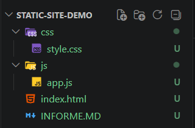

---

## Paso 2: Creación del archivo index.html

Se desarrolló la página principal del sitio web utilizando HTML.

### Evidencia

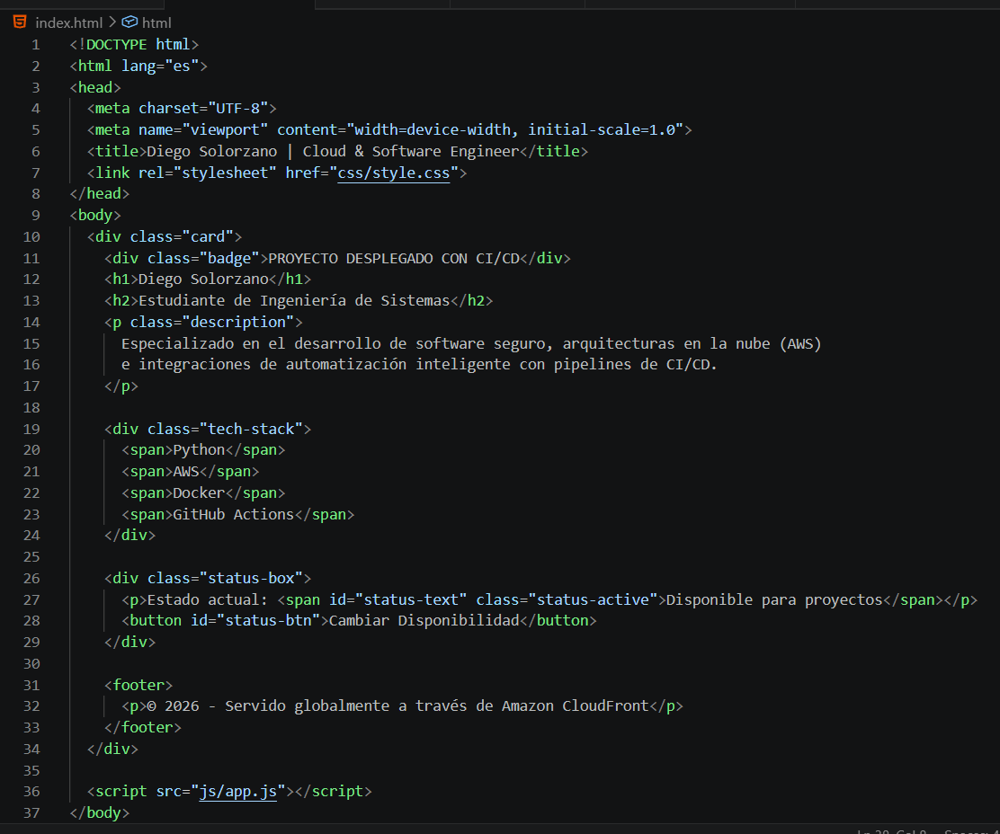

---

## Paso 3: Creación de estilos CSS

Se implementaron estilos personalizados en el archivo `style.css`.

### Evidencia

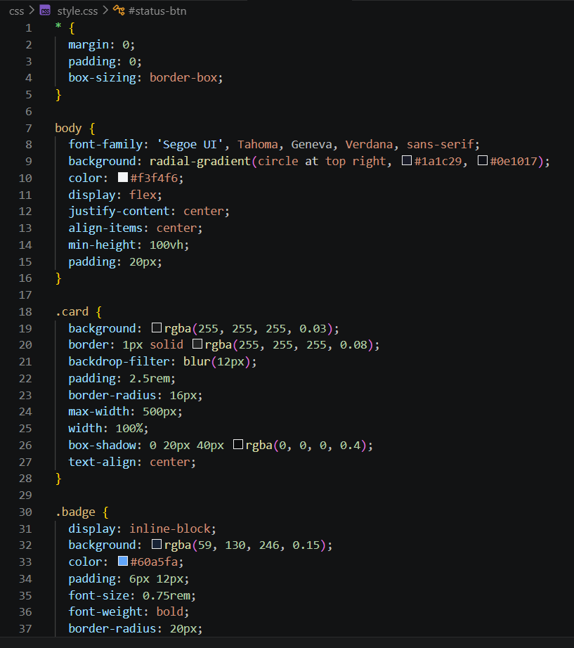

---

## Paso 4: Implementación de JavaScript

Se agregó interactividad básica mediante JavaScript en el archivo `app.js`.

### Evidencia

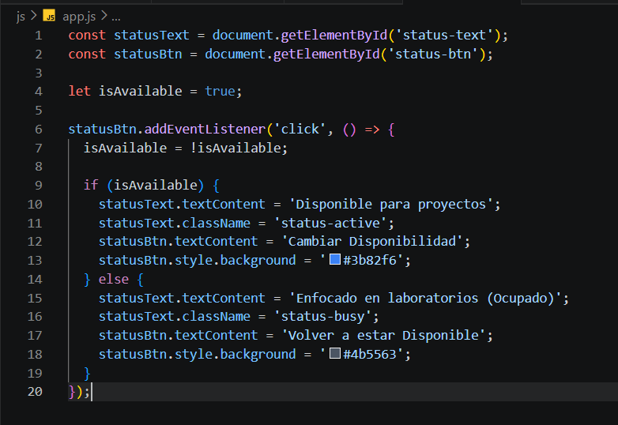

---

## Paso 5: Verificación local del sitio web

Se abrió el archivo `index.html` en el navegador para verificar el correcto funcionamiento del sitio.

### Evidencia

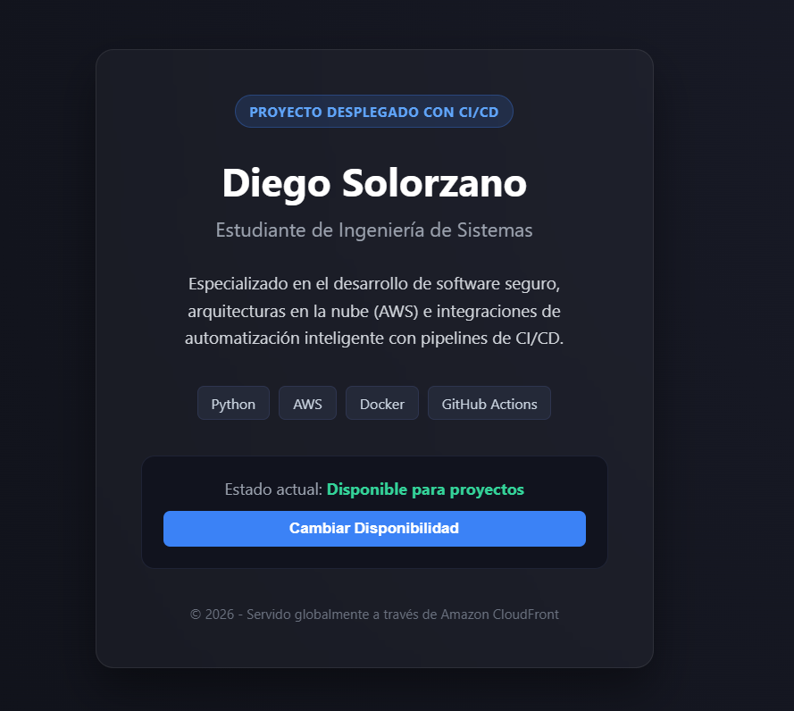
---

## Paso 6: Creación del repositorio GitHub

Se inicializó Git y se subió el proyecto al repositorio remoto en GitHub.

### Comandos utilizados

```bash
git init
git add .
git commit -m "feat: inicializa sitio web estatico"
git branch -M main
git remote add origin https://github.com/DiegoSolorzano9/static-site-demo.git
git push -u origin main
```

### Evidencia

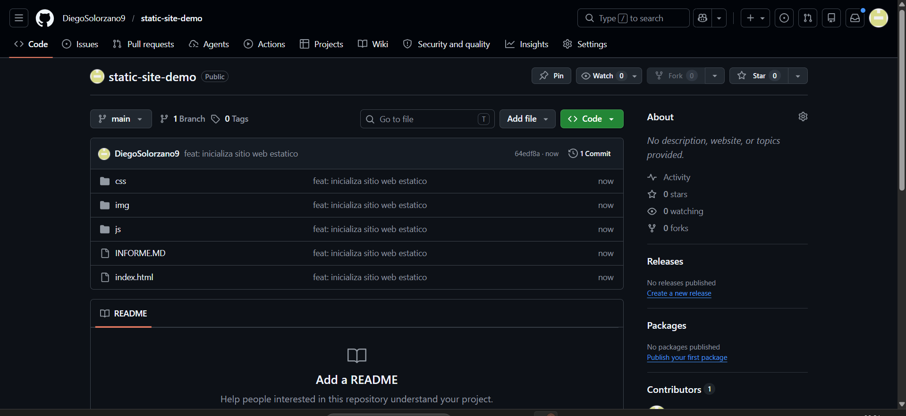
---

## Paso 7: Creación y configuración del bucket S3

Se creó un bucket S3 habilitando el hosting estático.

### Configuración aplicada

- Bucket público habilitado.
- Hosting estático activado.
- Documento índice: `index.html`

### Evidencia

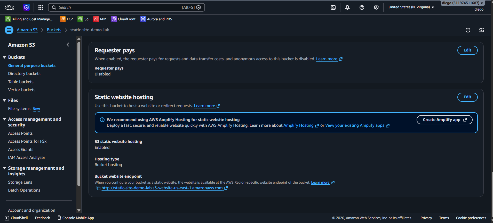
---

## Paso 8: Configuración de política pública del bucket

Se configuró la política del bucket para permitir acceso público de lectura.

### Política utilizada

```json
{
    "Version": "2012-10-17",
    "Statement": [
        {
            "Sid": "AllowCloudFrontServicePrincipal",
            "Effect": "Allow",
            "Principal": {
                "Service": "cloudfront.amazonaws.com"
            },
            "Action": "s3:GetObject",
            "Resource": "arn:aws:s3:::static-site-demo-lab/*",
            "Condition": {
                "ArnLike": {
                    "AWS:SourceArn": "arn:aws:cloudfront::511974511687:distribution/EFQC3L39LX6CL"
                }
            }
        }
    ]
}
```

### Evidencia

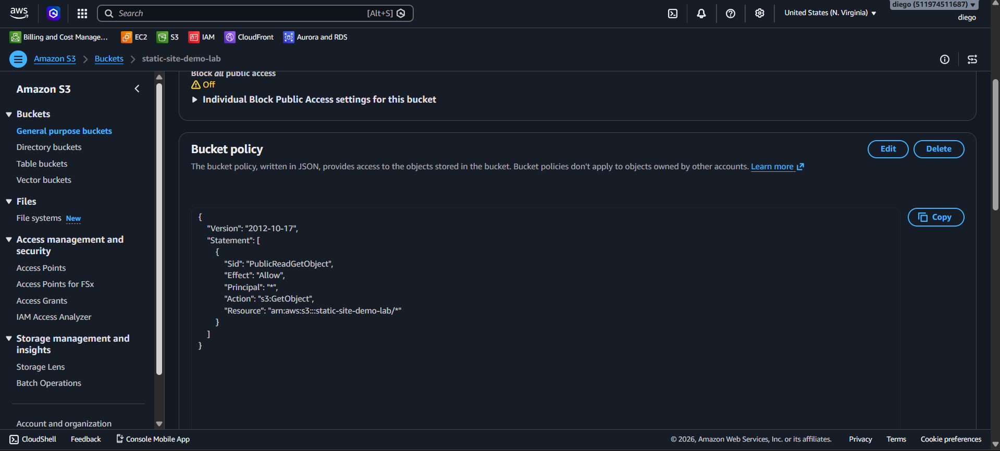

---

## Paso 9: Creación del usuario IAM

Se creó un usuario IAM para despliegues automáticos desde GitHub Actions.

### Evidencia

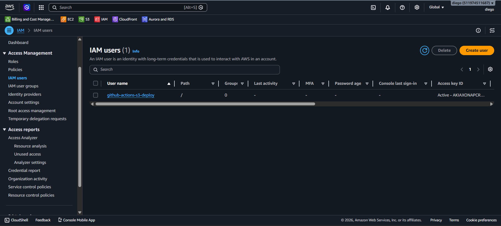
---

## Paso 10: Generación de Access Keys

Se generaron credenciales de acceso programático para GitHub Actions.

### Evidencia

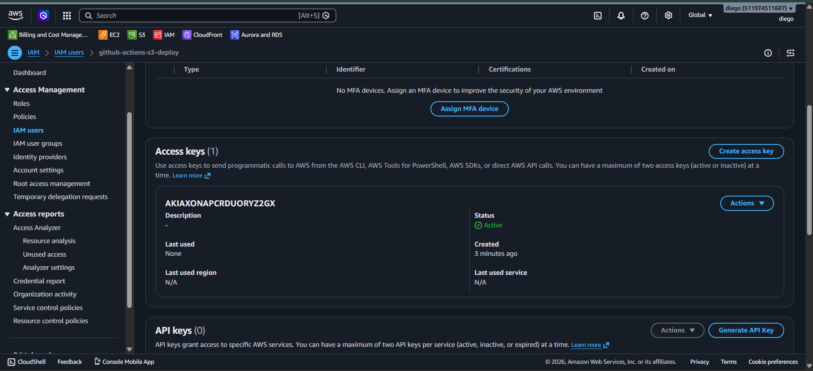
---

## Paso 11: Configuración de Secrets y Variables en GitHub

Se configuraron los secretos y variables necesarios para el workflow.

### Secrets configurados

| Secret | Descripción |
|---|---|
| AWS_ACCESS_KEY_ID | Access Key de IAM |
| AWS_SECRET_ACCESS_KEY | Secret Access Key de IAM |
| CLOUDFRONT_DISTRIBUTION_ID | ID único de la distribución de CloudFront|


### Variables configuradas

| Variable | Descripción |
|---|---|
| AWS_REGION | Región AWS |
| AWS_S3_BUCKET | Nombre del bucket |

### Evidencia

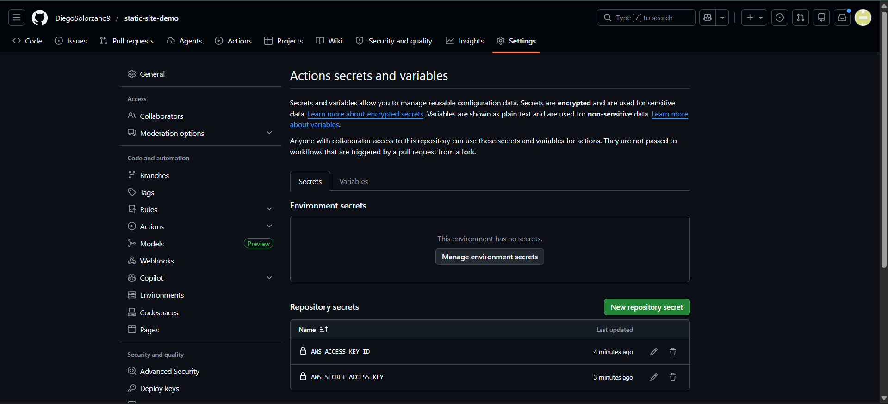
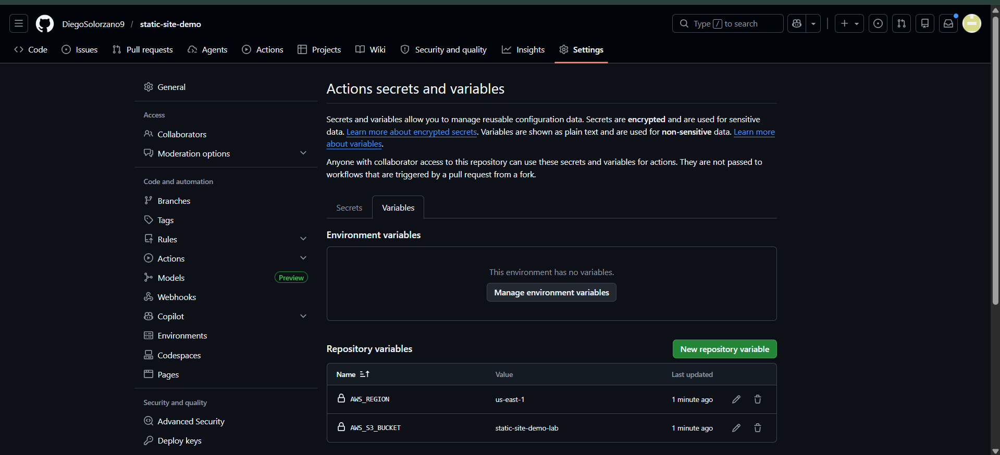

---

## Paso 12: Creación del workflow GitHub Actions

Se creó el archivo `.github/workflows/deploy.yml` para automatizar el despliegue.

### Workflow implementado

```yaml
name: Deploy Static Site to S3

on:
  push:
    branches: [main]

jobs:
  deploy:
    runs-on: ubuntu-latest

    steps:
      - name: Checkout del codigo
        uses: actions/checkout@v4

      - name: Configurar credenciales de AWS
        uses: aws-actions/configure-aws-credentials@v4
        with:
          aws-access-key-id: ${{ secrets.AWS_ACCESS_KEY_ID }}
          aws-secret-access-key: ${{ secrets.AWS_SECRET_ACCESS_KEY }}
          aws-region: ${{ vars.AWS_REGION }}

      - name: Sincronizar archivos con S3
        run: |
          aws s3 sync . s3://${{ vars.AWS_S3_BUCKET }} \
            --delete \
            --exclude ".git/*" \
            --exclude ".github/*" \
            --exclude "README.md" \
            --exclude "INFORME.md"
            
      - name: Invalidar cache en CloudFront
        run: |
          aws cloudfront create-invalidation \
            --distribution-id ${{ secrets.CLOUDFRONT_DISTRIBUTION_ID }} \
            --paths "/*"
```

### Evidencia

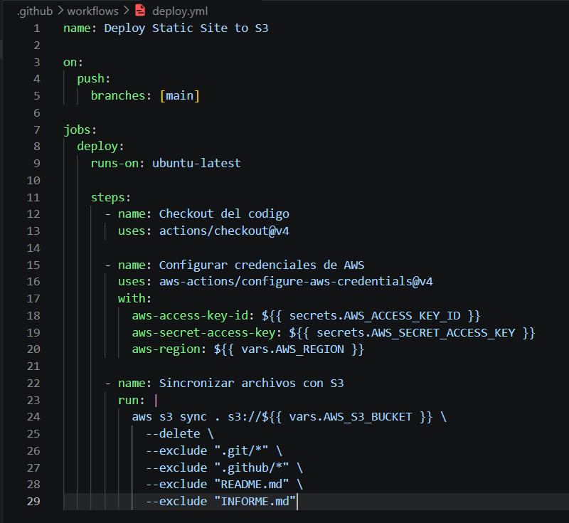

---

## Paso 13: Ejecución del pipeline CI/CD

Se realizó un push al repositorio para ejecutar automáticamente el workflow.

### Evidencia

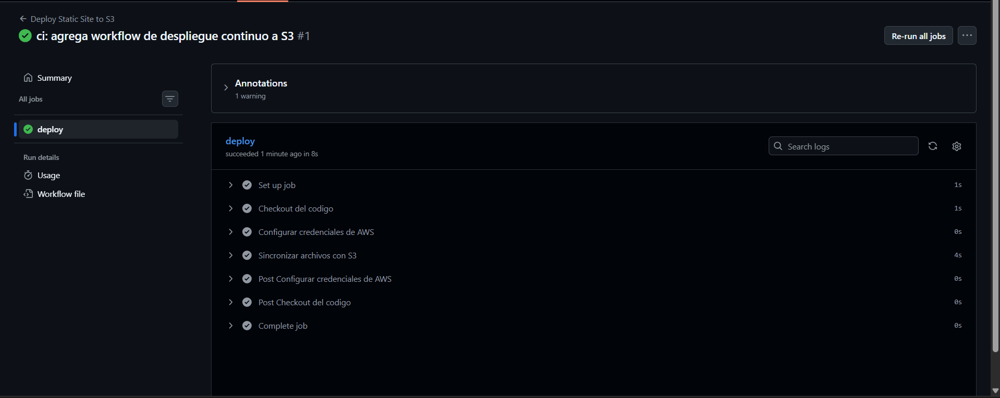

---

## Paso 14: Verificación del despliegue en S3

Se verificó que los archivos fueron sincronizados correctamente en el bucket.

### Evidencia

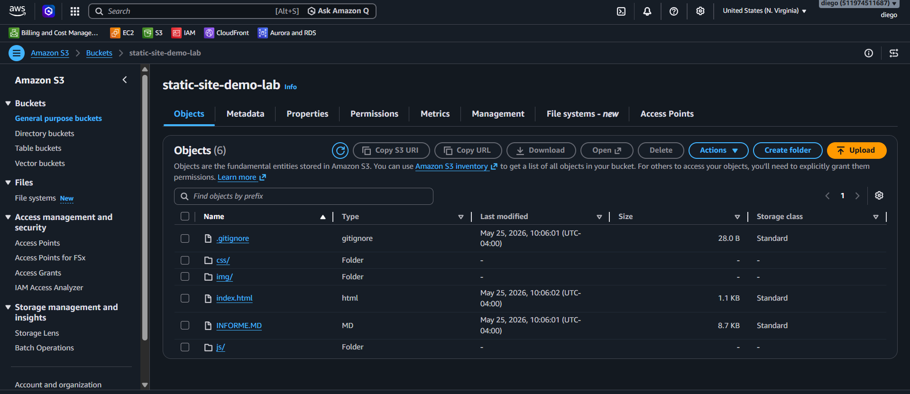
---

## Paso 15: Acceso público al sitio web

Se accedió al endpoint público del bucket S3.

### URL del sitio

```text
http://static-site-demo-lab.s3-website-us-east-1.amazonaws.com
```

### Evidencia

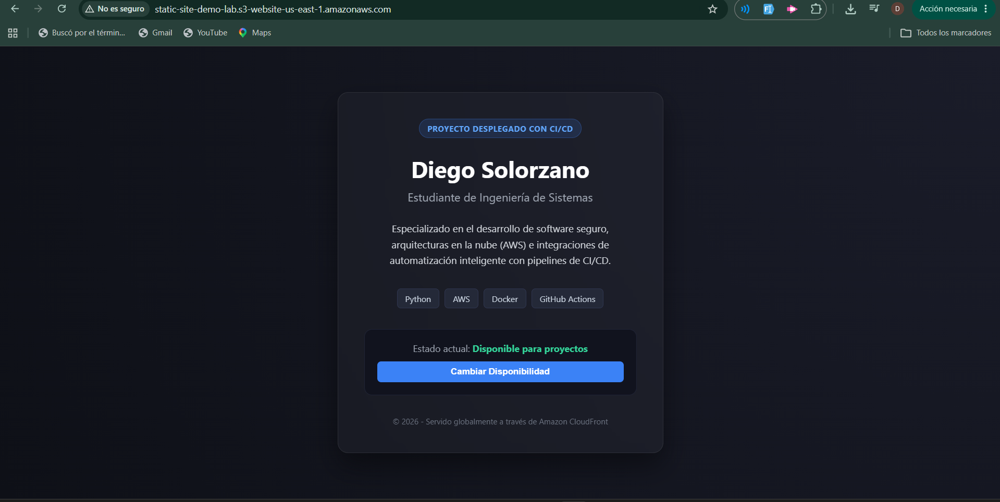
---

## Paso 16: Actualización automática del sitio

Se modificó el contenido del sitio y se realizó un nuevo push para verificar el despliegue automático.

### Evidencia

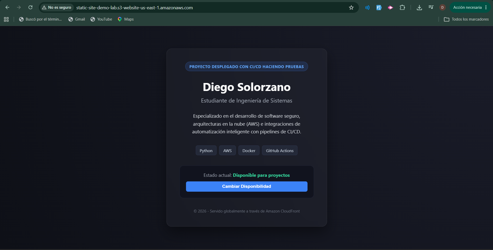

---

## Paso 17: Simulación de fallo intencional

Se provocó un error en el workflow modificando temporalmente la configuración del bucket o credenciales.

### Resultado observado

El workflow falló correctamente y posteriormente se corrigió el error.

### Evidencia

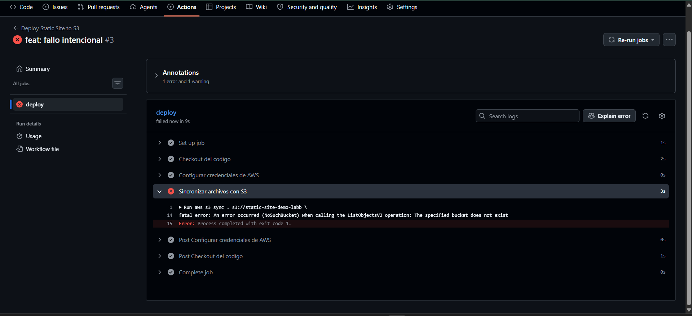
---

## Paso 18: Corrección del fallo y redeploy exitoso

Se corrigió el error y se ejecutó nuevamente el workflow exitosamente.

### Evidencia

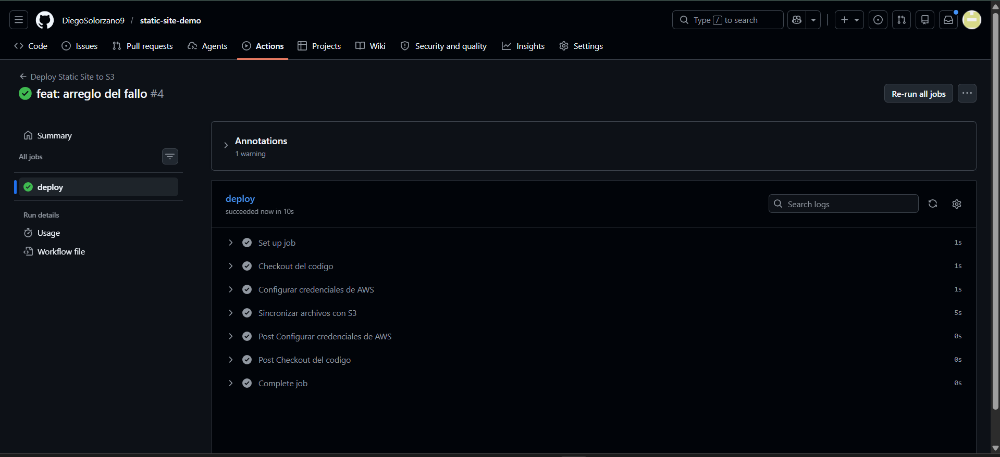
---

## Paso 19: Configuración de Amazon CloudFront

Se creó una distribución CloudFront utilizando el bucket S3 como origen.

### Configuración aplicada

- Origin Access Control (OAC)
- HTTPS habilitado
- Distribución pública

### Evidencia

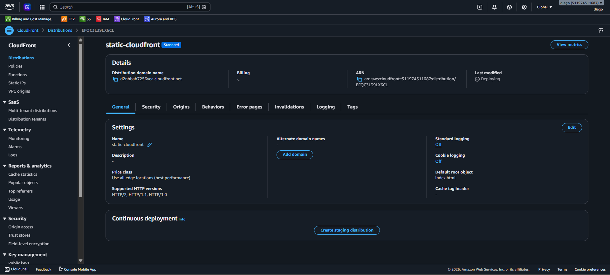
---

## Paso 20: Invalidación de caché automática

Se configuró la invalidación automática de caché en el workflow.

### Evidencia

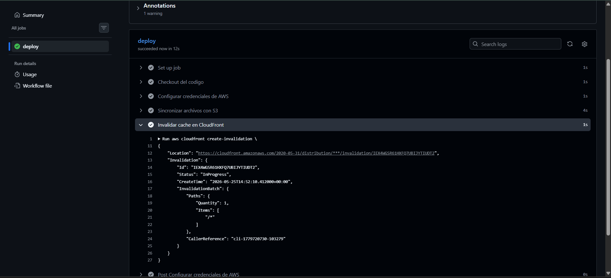
---

# 4. Resultados Obtenidos

- Se logró desplegar correctamente un sitio web estático utilizando Amazon S3.
- Se implementó un pipeline CI/CD funcional con GitHub Actions.
- Se automatizó el proceso de despliegue mediante push al repositorio.
- Se configuró CloudFront para distribución segura mediante HTTPS.
- Se validó el correcto funcionamiento del despliegue continuo.

---

# 5. Problemas Encontrados y Soluciones

| Problema | Solución |
|---|---|
| Error de permisos en S3 | Se corrigió la política pública del bucket |
| Fallo en GitHub Actions | Se verificaron secrets y variables |
| Sitio no actualizaba cambios | Se realizó invalidación de caché en CloudFront |

---

# 6. Conclusiones

- GitHub Actions permite automatizar despliegues de manera eficiente.
- Amazon S3 es una solución sencilla y económica para hosting estático.
- CloudFront mejora el rendimiento y seguridad del sitio web.
- El uso de CI/CD reduce errores manuales y acelera la entrega de cambios.

---

# 7. Recomendaciones

- Utilizar políticas IAM con permisos mínimos en producción.
- Configurar dominios personalizados con HTTPS.
- Implementar monitoreo y logs del pipeline CI/CD.
- Mantener protegidos los secretos y credenciales.

---

# 8. Enlaces Finales

## Repositorio GitHub

```text
https://github.com/DiegoSolorzano9/static-site-demo.git
```

## URL pública S3

```text
http://static-site-demo-lab.s3-website-us-east-1.amazonaws.com/
```

## URL CloudFront

```text
https://d2nhbah7256vea.cloudfront.net/
```

---


